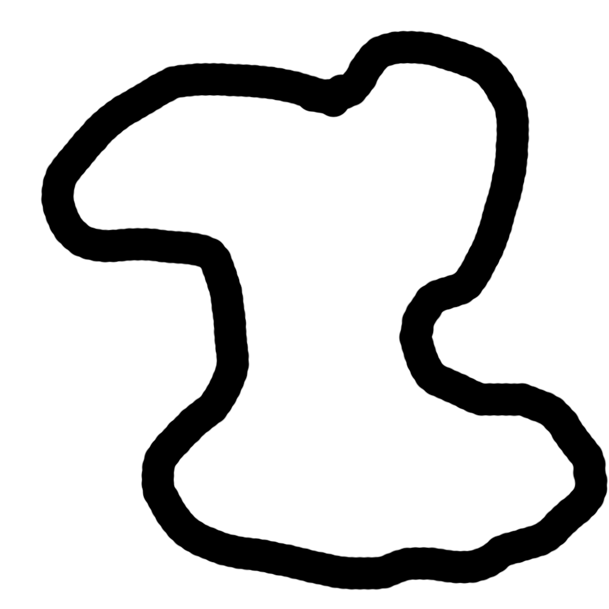

# Machine Learning Self Driving Car

A 2D Unity simulation that trains a car to drive around a track for as long and as fast as possible. The car is controlled using a fully connected neural network and is trained through a genetic algorithm.

  
 [Click to see a demo video on youtube](http://www.youtube.com/watch?feature=player_embedded&v=oYBysMULeiA)  

## The Car
The car is equipped with 5 sensors, 2 on both sides, 2 at 45 degrees, and 1 straight ahead.

## Neural Network
The network is customizable in terms of how many layers and the number of nodes in each layer. The type of network is fixed (feed forward) and I would like to try new network types in the future. 
The network I used to run the cars is comprised of 3 layers. The input layer has 5 inputs for the car's sensors and another one for the speed of the car. 5 neurons for the hidden layer and 2 neurons for the output (1 for left/right turning and 1 for forwards/reverse. Thicker lines indicate bigger weights, green is a positive multiplier, red is a negative multiplier.

## Genetics & Evolution
To train the network, I used a genetic algorithm that evolved the network similar to how species evolve in the real world over thousands of generations to become better at a task. 
### The Process
Firstly, we generate an initial random population (the number of creatures in each generation can be changed). Each "creature" has its own genome that is made of different genes, each gene is a bias of a neuron or the weight of a connection between neurons.
#### Evaluate
We then simulate each creature and evaluate how well they performed in the environment using a fitness function. The fitness function is made of 3 parts: the creature's average speed, the distance the creature travelled, and how close to the middle of the track the creature was during its run (How much you value each of these metrics can be changed to influence the fitness function).
#### Breeding
Once we calculate the fitness of all the creatures in the generation, we sort them by fitness to determine what the best creatures were. Just like survival of the fittest, the creatures with higher fitness levels have a higher chance to "mate" and have their genes passed on to the next generation. However, in order to prevent us from converging to fast on a local optimum, there is a chance that less performing creatures can sneak in and have their genes passed on as well. This was done through [roulette wheel selection](https://en.wikipedia.org/wiki/Fitness_proportionate_selection). Once we have selected the two parents to mate, we mix their genomes using [uniform crossover](https://en.wikipedia.org/wiki/Crossover_(genetic_algorithm)) where for each gene we randomly select which child gets which gene.
#### Mutation
Once we have bred the next generation, we randomly (with a small chance) choose genes to alter. The advantage of mutation in genetic algorithms is that it allows us to escape local optimal and create a better performing car. For example, we mutate the weight between the left car sensor which causes the car to turn right when it is close to the wall, thus increasing the fitness of the vehicle. 

We then repeat the process until we are happy with the results.
## Track

## How to use
- Download the project files and run inside the unity editor, under multi agent scene
- Configure training properties in the Academy game object

## Future Goals
- Have the structure of the NN as part of the breeding process
- Neural Networks with memory

### ToDo:
- Load from saved NN file
- More Track Types

## Acknowledgments
- Car and Track: [Quill18](https://www.youtube.com/channel/UCPXOQq7PWh5OdCwEO60Y8jQ)  
- NN Design Inspiration taken from: [ArztSamuel](https://github.com/ArztSamuel)
